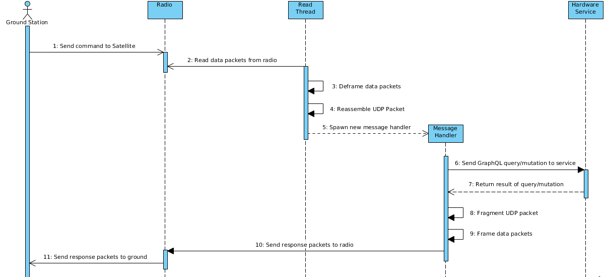
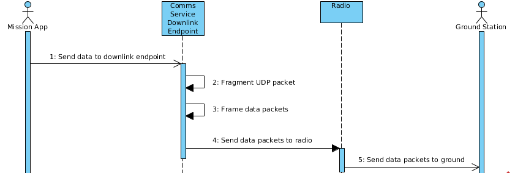
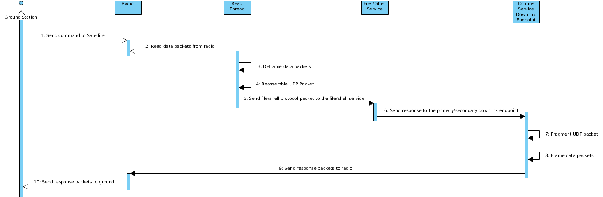

Communications Service
======================

Communication services serve as the connection between the radio hardware interface and the rest
of the flight software. Communication services are integrated into radio hardware services so that
they provide a tunnel for data to travel through utilizing a specific radio's API while also 
providing a queryable endpoint for GraphQL queries and mutations to interact with. 

The ethernet service provides an example of such integration and services as a mock radio 
interface.

Comms Service Overview
----------------------

The communication service is designed to work under three different use cases. The first use case 
is making requests for information from the ground. This will typically be used to debug 
communications, services, and mission apps from the ground. The data will be uplinked to an 
onboard radio where it will be read by the communication and then handled in message handling 
threads. It is the responsibility of each thread to communicate with a specific service or 
application, wait for a response, and then write that response back to the radio to downlink to 
the ground. The complete process is visualized in the figure below:

The next use case that the communication service is designed to handle is to allow mission 
applications to communicate data and telemetry to the ground during missions. This simply requires 
the mission app to sends any data it wants to send to the ground to an designated comms service 
endpoint which is a UDP port, and then have that thread write that data to the radio to downlink to
the ground. This process can be seen below:

The third and final use case is to allow end to end communication between the ground and the 
satellite for the file service and shell service. The request to initiate this end to end link starts
from the ground as in the first case, but instead of passing data to a message handler, the data is 
rerouted directly to each service where they can communicate with one of the comms service endpoints 
and send data to the ground. This essentially creates a link between the ground and either service 
which allows for transferring files to and from the satellite or opening a shell session with the 
satellite.

Comms Service Usage
-------------------

Overview
~~~~~~~~

In order to use the comms service library, you need to pass both a comms service control block and
a comms service telemetry block wrapped in a Arc Mutex into the start function. This will spawn a read 
loop for uplink traffic, message handlers for responses to this traffic, and downlink endpoints for 
downlink traffic originating from with KubOS.   

Comms Service Control Block
~~~~~~~~~~~~~~~~~~~~~~~~~~~

The comms service control block is used to pass a specific configuration details into a 
communications service. The control block can be filled manually or with the help of a 
configuration CommsConfig struct that can be used to parse a TOML file to obtain most of the 
configuration details into the control block. Developers will then need to provide connections to
specific interfaces and the read and write functions across those interfaces.

The control block requires filling the following fields:

**read**
  This is an optional function pointer wrapped in an Arc that will read data from a radio, deframe 
  those data packets, and then compose any fragmented packets into a single UDP packet. This 
  function is necessary for developers wanting uplink communication to the radio.

**write**
  This is a vector of function pointers each wrapped in Arcs that fragment a UDP packet as 
  necessary, frame these fragments and then write these fragments across the radio interface for
  downlink communication. At least one write function is required for the communication service to
  work. If multiple functions are provided, the first will be used to downlink any responses to 
  uplinked traffic. All provided write functions will also be used to spawn endpoints that mission 
  applications can write to downlink information.

**read_conn**
  This is the interface connection to the radio that the read function will read from.

**write_conn**
  This is the interface connection to the radio that the write function will write to.

**handler_port_min**
  In order to coordinate communication between the comms service and different services 
  asynchronously, handler threads are spawned to handle individual GraphQL requests. This field 
  describes the lower end of a range of ports reserved for handler threads.

**handler_port_max**
  This field describes the upper end of a range of ports reserved for handler threads.  

**timeout**
  Timeout for the completion of GraphQL operations within message handlers in milliseconds.

**ground_ip**
  The IP address of the ground gateway. This is used to build UDP checksums.

**satellite_ip**
  The IP address of the computer that is running the comms service. This is used to build UDP 
  checksums.

**downlink_ports**
  Ports that are used to spawn downlink endpoints, one for each of different write function 
  provided. The number of ports provided each should match the number of write functions provided.

**ground_port**
  The port which the ground gateway is bound. Used as the destination in downlink UDP packets.

Comms Configuration
~~~~~~~~~~~~~~~~~~~

Developers can use the CommsConfig library to generate easy to utilize structs from TOML files to 
allow developers to quickly reconfigure some details passed into a comms service control block
without needing to recompile the binary of the particular hardware service. 

A complete configuration file looks like the following:

::

   [ethernet-service]
   handler-port-min = 13002
   handler-port-max = 13010
   downlink-ports = [13011]
   ground-port = 9001
   timeout = 1500
   ground-ip = "192.168.8.1"
   satellite-ip = "192.168.8.2"

Note that all provided fields are optional and will be filled in by default values if they are
formatted incorrectly or missing.

Comms Service Telemetry
~~~~~~~~~~~~~~~~~~~~~~~

A GraphQL comms service telemetry object holds data collected from the comms service. It is 
provided in the library and is one of the arguments required to start the comms service. This 
shared telemetry object needs to be wrapped in an Arc Mutex so it can then be passed into a 
service's subsystem that can be used in GraphQL queries.

The comms service telemetry requires filling the following fields:

**errors**
  Any errors that have occured while the comms service has been running.

**packets_up**
  The number of good uplink packets.

**packets_down**
  The number of good downlink packets.

**failed_packets_up**
  The number of bad uplink packets.

**failed_packet_down**
  The number of bad downlink packets.